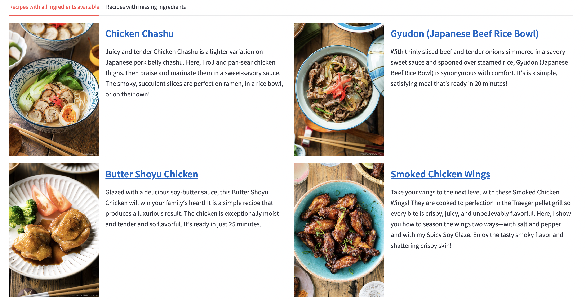

# Asian Recipe Recommendation

This project is a recipe recommendation system that suggests Asian recipes based on ingredients that the user has available at home. The app is deployed on [Streamlit Cloud](https://asian-recipe-recommendation.streamlit.app/) and is available for the public to use.





## Features

- **Ingredient-based Search**: Users can input a list of ingredients they currently have at home, and the app will recommend recipes that can be made with those ingredients.
- **Cuisines and Courses Filter**: You can filter recipes based on your preferred cuisines and course types (e.g., appetizer, main course, dessert).
- **Cooking Time Filter**: Recipes can be filtered based on a maximum cooking time.
- **Missing Ingredients**: The app also helps identify recipes that can be made with the ingredients the user has, as well as recipes with a few missing ingredients that can easily be substituted.


## How It Works

1. **Scraping Recipes**: I scraped over 2000 recipes from 5 different food blogs to build the recipe database. This allows for a variety of Asian recipes, from Chinese to Japanese, Korean, and Indian cuisines.
2. **Standardising Ingredients**: 
    - The challenge in ingredient standardisation arises from the fact that each food blog lists ingredients in different ways. This results in nearly 3,700 unique ingredients across all the recipes, with many of them representing the same ingredient under different names.
    - For example, "salt" can appear in various forms, such as "kosher salt," "flaky salt," or "sea salt." These ingredients all refer to the same thing, but different recipe creators use different terms.
    - To address this, I used an LLM (Gemma - 9B) to standardise ingredient names. The LLM grouped similar ingredients under common standardised names, ensuring that ingredients such as "Thai Chili Pepper," "Kashmiri Chilli," and "dried red chilies," are all mapped to "Chilli Peppers" in the system. This process was necessary to ensure better matching of ingredients across the recipes, as ingredients can have multiple terms, regional differences, or misspellings.
3. **Database**: The scraped recipes were stored in an SQLite database, which includes columns for recipe details like title, link, description, image URL, ingredients, course, cuisine, and cooking time.
4. **Filtering and Recommendation**: Once the user inputs their ingredients, the app filters recipes that match those ingredients, taking into account any missing ingredients that the user can substitute.

## Technologies Used

- **Streamlit**: For building the interactive web app.
- **SQLite**: For storing the recipe database.
- **Pandas**: For data manipulation and analysis.
- **Fuzzywuzzy**: For string matching and handling variations in ingredient names.
- **Ollama**: For ingredient standardisation using the LLM - Gemma 9B.

## Access the App

You can access the Asian Recipe Recommendation app directly on Streamlit Cloud:

[Visit the app](https://asian-recipe-recommendation.streamlit.app/)

There is no need to run the app locally unless you want to customize or develop it further.

## Installation and Setup (Optional)
To run the app locally:

1. Clone the repository:
   ```bash
   git clone https://github.com/yourusername/asian-recipe-recommendation.git
   cd asian-recipe-recommendation
   ```

2. Install Dependencies:
    ```bash
    pip install -r requirements.txt
    ```

3. Run the app:
    ```bash
    streamlit run streamlit_app.py
    ```


## Development: Errors and Solutions


1. **Ingredient Standardization Issues**:
   - **Problem**: During the ingredient standardisation process using the LLM (Large Language Model), it struggled to finish processing approximately 600 out of 3700 ingredients. This was primarily due to the presence of uncommon symbols, such as Japanese or Chinese characters, which caused issues with the model's ability to recognize and process these ingredients.
   - **Solution**: To address this problem, I cleaned the ingredient list by removing any symbols other than A-Z letters. This step ensured that only ingredients with standard Latin letters were processed by the LLM, allowing the model to successfully standardise all the ingredients.

2. **Database Handling of Ingredient Lists**:
   - **Problem**: The database I was using could not handle lists directly in columns. Specifically, the `ingredients` column contained lists of ingredients, but the database was not capable of storing such data types. This created issues when saving and retrieving ingredient data, as the list format was incompatible with the database's requirements.
   - **Solution**: To solve this, I converted the lists of ingredients into comma-separated strings before saving them to the database. However, when reloading the data, a new issue arose: the comma separator caused ingredients like "boneless, skinless chicken legs" to be split incorrectly into two separate ingredients ("boneless" and "skinless chicken legs"). To fix this, I changed the delimiter to `;`, a less common character that wouldn't interfere with ingredient names, ensuring the data was correctly parsed when reloaded.

3. **Handling Missing Ingredient Names**:
   - **Problem**: During the ingredient standardisation process using the LLM, if the model couldn't recognise an ingredient, it was assigned a `NaN` value as its standardised name. This happened to about 400 of the 3700 ingredients. Since some of these `NaN`-labeled ingredients might still be valid ingredients, it was important not to discard them.
   - **Solution**: To address this, I reran all ingredients labelled as `NaN` through the LLM again. This allowed the model to attempt to standardise them once more. After getting the new results, I manually reviewed each one to ensure the standardised name was correct. If I disagreed with the model's suggestion, I made the necessary changes to ensure the ingredient was mapped correctly.

4. **Fuzzy Matching for Pluralization and Regional Variations**:
   - **Problem**: After standardising ingredients, I had approximately 924 unique ingredient names. However, I noticed that multiple variants existed for the same ingredient due to pluralisation (e.g., "pepper" vs. "peppers"), misspellings (e.g., "salt" vs. "sal"), and regional differences (e.g., "cilantro" vs. "coriander").
   - **Solution**: To tackle this, I used the `fuzzywuzzy` Python library, which employs Levenshtein distance to calculate similarity scores between ingredient names. I manually reviewed each pair of ingredients with a fuzzy score above 75 and decided whether they should be merged under the same standardised name. After this process, I reduced the number of unique ingredient categories by about 200. Lastly, I manually cleaned the resulting list to account for regional differences in ingredient names (which weren't pciked up by fuzzy wuzzy), ensuring consistency across all standardised names.


## Future Improvements

- Add a user authentication system to save favorite recipes.
- Implement machine learning models to suggest ingredient substitutions.
- Extend the recipe database by scraping more food blogs.
- Improve ingredient matching using more advanced NLP techniques.

## Conclusion

This project helps users discover Asian recipes based on the ingredients they already have at home, while also providing insights into missing ingredients for each recipe. While the app doesn't handle ingredient substitutions directly, it allows users to see what ingredients they are missing and provides useful recommendations for recipes based on their pantry. It's a fun and practical tool for anyone looking to explore new dishes and make the most out of their pantry!